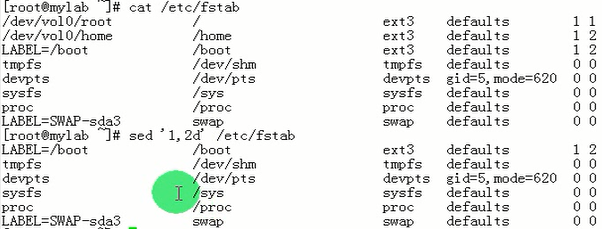
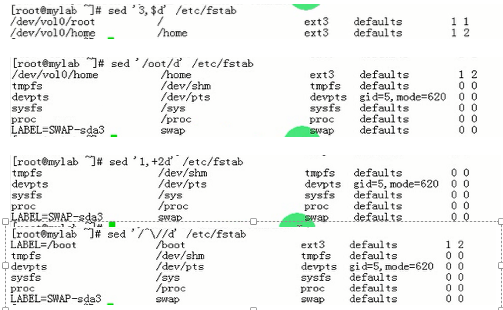
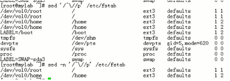

[TOC]

grep：
sed：流编辑器
awk：报告文本的生成器

#### sed基本用法

Sed ： stream Editor(逐行进行操作)

不直接处理文本本身， 逐行读取到内存空间进行存储，处理完成后输出到屏幕
内存空间叫做sed的模式空间 （符合模式的行存贮在模式空间）
**默认不编辑文件，仅对模式空间中的数据做处理**

```bash
sed [OPTION]... {script-only-if-no-other-script} [input-file]…
	-n: 静默模式，不再显示模式空间内的内容
	-i 直接修改原文件
	-e script -e script  可以同时执行多少个脚本
	-f /PATH/to/scipt  将脚本中的文件一个一个的去运行
	-r  表示使用扩展的正则表达式
```


#### sed 'AddressCommand' file … 

##### Address:

```
1. Startline,Endline
	比如1，100
	$ 最后一行
	$-1 ，倒数第二行

2. /RegExp/     <<< 正则表达式
   /^root/      以root开头的行
3. /pattern1/，/pattern2/  第一次被模式1匹配到的行开始至第一次被模式二匹配到的行结束
4. LineNumber  指定的行
5. StartLine，+N  从startline开始，向后的N行
```

##### Command：

```
	d：删除符合条件的行
	p：显示符合条件的行
	a \string 在指定的行后面追加新的行
	i \string 在指定的行前面追加新的行
	r FILE： 将指定文件的内容添加至符合条件的 行处
	w FILE 将指定范围内的文件保存到文件中去
	s/pattern/string/修饰符：查找并替换，默认只替换每行中第一次被模式匹配到的字符串
		加修饰符：
		g：全局替换
		i：查找时忽略大小写
		/可以替换成其他字符#， 或者@
		
		
		\(\)  ,  \1   , \2   后向引用
		& 匹配前面的整个字符串
```

##### d：删除符合条件的行





##### p：显示符合条件的行

