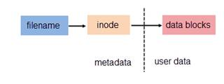
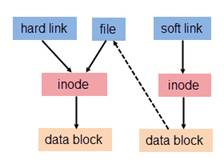
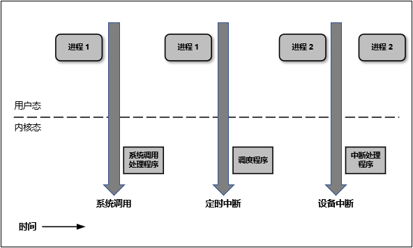
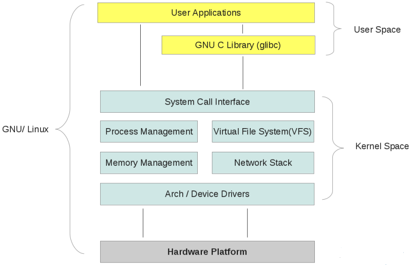
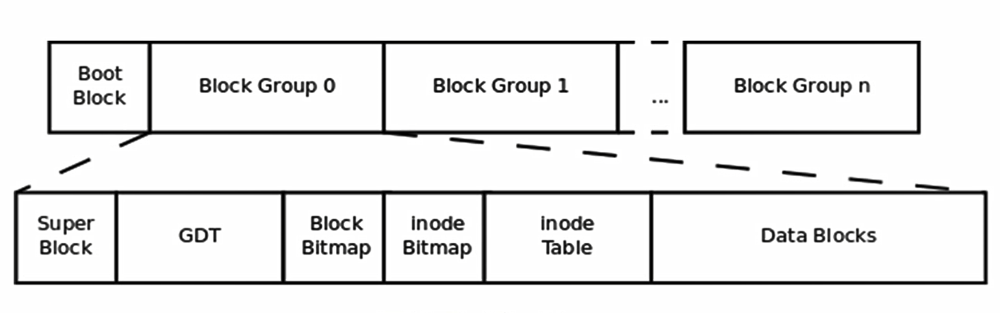

[TOC]

磁盘管理：

- 分区是磁盘的逻辑边界
- 磁道/扇区/柱面
- 扩展分区只能有一个
- 磁盘分区是按照柱面进行的
- 平局寻道时间是衡量一个磁盘优劣的标准（转速）IOPS  
- 最外层的磁道具有最大的存取速率。

**MBR**： Master boot record/main boot record 主引导记录 512byte

​	446byte：bootloader，程序，引导加载器
​	64bytes：每16bytes标识一个分区  所以一个磁盘最多划分4个`主分区` 可以拿16字节作为扩展分区（指针指向其他地方）
​	Magic Number：标记MBR是否有效

BIOS 查找MBR， 找到MBR后加载BootLoader进内存，并退出；BootLoader读取分区表，并在分区中寻找操作系统，将操作系统内核加载内存中，等待内核启动成功， 退出BootLoader，内核启动操作系统。

文件系统：是个软件，可以将一个分区划分为两片 元数据存储区/数据存储区， 数据存储区会被进一步划分为block。

- 元数据存储区有个区域称之为bitmap， 块位图，用于表示block是否被使用。
- 元数据存储区最主要是为了存储index node，存储index node的区域也会有相应的bitmap
- index node 存储非文件名和数据的其他数据例如属主属组，大小，创建时间
- 文件名存储在目录中，目录存储在磁盘块中（block）

[Linux 深入理解inode/block/superblock](https://www.cnblogs.com/machangwei-8/p/10354451.html)

[硬链接与软链接的区别和联系](https://www.ibm.com/developerworks/cn/linux/l-cn-hardandsymb-links/index.html)





##### ln

```bash
ln SRC DES   <<< 硬链接
-s 软链接     <<< 注意使用绝对路径
-v verbose
```

##### 硬链接

- 只能对文件创建，不能应用于目录
- 不能跨文件系统
- 创建硬链接会增加文件被链接的次数

##### 符号链接

- 可应用于目录
- 可以跨文件系统
- 不会增加被链接文件的链接次数
- 其大小为指定的路径所包含的字符个数；

##### df-检查磁盘空间占用情况(并不能查看某个目录占用的磁盘大小)。

```bash
-h 以容易理解的格式(给人看的格式)输出文件系统分区使用情况，例如 10kB、10MB、10GB 等。
-k 以 kB 为单位输出文件系统分区使用情况。
-m 以 mB 为单位输出文件系统分区使用情况。
-a 列出所有的文件系统分区，包含大小为 0 的文件系统分区。
-i 列出文件系统分区的 inodes 信息。
-T 显示磁盘分区的文件系统类型。

[root@xuxing ~]# df  -h     <<<<  分区挂载在文件系统上
Filesystem               Size  Used Avail Use% Mounted on
/dev/mapper/centos-root  8.0G  3.3G  4.8G  41% /
devtmpfs                 7.8G     0  7.8G   0% /dev
tmpfs                    7.8G     0  7.8G   0% /dev/shm
tmpfs                    7.8G   49M  7.8G   1% /run
tmpfs                    7.8G     0  7.8G   0% /sys/fs/cgroup
/dev/sda1               1014M  143M  872M  15% /boot
tmpfs                    1.6G     0  1.6G   0% /run/user/0
```

##### du-显示文件或目录所占的磁盘空间

```bash
-h 以容易理解的格式(给人看的格式)输出文件系统分区使用情况，例如 10kB、10MB、10GB 等。
-s 显示文件或整个目录的大小，默认单位为 kB
```

##### 设备文件

- 按块为单位，随机访问的设备 （块设备）
- 按字符为单位，逐个进行访问的设备（字符设备）

##### /dev

```
crw-rw----. 1 root tty       7,   6 Feb 28 15:31 vcs6
							|     |______次设备号， 标识同一个类型中不同设备
							|____________主设备号，标识设备类型
```

##### mknod-make block or character special files

```bash
mknod [OPTION]... NAME TYPE [MAJOR MINOR]
-m 
```

硬盘设备的设备文件名

IDE，ATA：通常以hd开头

SATA， SCSI： sd

USB

​	使用a,b,c,...来区分同一类型下的不同设备

##### fdisk -l 查看系统识别了几个硬盘

##### 管理磁盘分区

高级格式化： mkfs -t ext3     <<<< 其实是为了创建文件系统

VFS: virtual filesystem 

- FAT32 ：vfat （linux）

- NTFS
- ISO9660 (光盘)
- CIFS 
- ext2/ext3/ext4/xfs/reiserfs
- NFS
- OCFS2
- GFS2

```bash
fdisk /dev/sda
p：显示当前硬盘的分区， 包括没保存的改动
n：创建新分区
d：删除一个分区
w：保存退出
q：不保存退出
t：修改分区类型
l：显示所支持的所有类型
```

用户模式：用户空间

内核模式：内核空间

CPU有四个级别， ring 0（内核运行在次） ring1，ring2，ring3（用户程序运行在此/无法使用特权操作去直接操作硬件）





块组描述符/ 



每个磁盘分区的第一个block （boot block）是不会用来存储上数据， 存放MBR 512KB
后面会备直接划分块组， 每个块组会被划分成Super block/GDT 块组描述符表

- superblock：记录此filesystem 的整体信息，包括inode/block的总量、使用量、剩余量， 以及档案系统的格式与相关信息等；
- inode：记录档案的属性，一个档案占用一个inode，同时记录此档案的资料所在的block 号码；
- block：实际记录档案的内容，若档案太大时，会占用多个block 


##### Ext3 < - Ext2 

Ext 3/ 日志文件系统， 相对于EXT2的元数据区和数据区多了一个日志区， 日志区存放正在修改的元数据。


格式化分区：重新创建文件系统， 不要对以有数据的分区操作

格式化分区 - > 创建文件系统（格式化）`mkfs` make file system

##### mkfs

```bash
-t FSTYPE  加特定文件系统

mkfs -t ext2 = mkfs.ext2
mkfs -t ext3 = mkfs.ext3
```

专门管理ext系列文件系统的命令

`mke2fs` 

```bash
默认ext2， -j:ext3
-b BLOCK_SIZE:指定块大小，默认为4096.可以取值为1024，2048或4096
-L Label： 指定分区卷标；以后可以使用卷标来指定分区，防止sda number 因为重启而改变
	e2label :用于查看或定义卷标
	e2label 设备文件 卷标 ： 设定卷标
-m num   默认会预留5%大小给超级用户，可以手动指定百分比
-N 
-i byte-per-inode  指定多少个自己一个inode。默认为8192； 这里给出的数值应该为块的2^n 倍
-N 指定inode 的个数
-F： 强制创建文件系统，如果文件系统被挂载了就不能被格式化
-E：用户指定额外的文件系统属性
```

`blkid` 查询或查看磁盘设备的相关属性

```bash
[root@nso ~]# blkid /dev/sdb5
/dev/sdb5: UUID="945ab7d5-ec58-4614-88bd-2014e5a535cf" TYPE="ext2" 
[root@nso ~]# 

UUID:用来唯一标识一个分区

```

`tune2fs` 调整文件系统的相关属性

```bash
-j： 不损坏原有的数据，将ext2升级为ext3
-L 设定或修改卷标
-m 调整预留百分比
-r 指定预留块数
-o 设定默认挂载选项  acl
-c # 指定挂载次数达到多少次之后进行自检， 0 或 -1 表示关闭此功能
-i # 每挂载使用多少天后进行自检  0 或 -1 表示关闭此功能
-l 显示超级块中的信息
```

`dunmpe2fs` 显示所有磁盘设备的信息

`fsck` 检查并修复Linux 系统

```bash
-t FSTYPE 指定文件系统类型
-a 自动修复
```

`e2fsck` 指定检查并修复ext2 文件系统

挂载:将新的文件系统关联至当前根文件系统

卸载：将某文件系统与当先根文件系统的关联关系移除

##### mount

```bash
设备名 挂载点
设备：
	设备文件 /dev/sda4
	卷标： LABEL=""
	UUID: UUID=""
挂载点：目录
	1.此目录没有被其他进程使用
	2.目录得事先存在
	3.目录中的原有文件会暂时被隐藏
显示当前系统以及挂载的设备以及挂载点
-a ： 表示挂载/etc/fstab 文件中定义的所有文件系统
-n ： 默认情况下，mount命令每挂载一个设备，都会把挂载的设备信息保存至/etc/mtab文件；使用—n选项意味着挂载设备时，不把信息写入此文件；
-t FSTYPE: 指定正在挂载设备上的文件系统的类型；不使用此选项时，mount会调用blkid命令获取对应文件系统的类型；
-r: 只读挂载，挂载光盘时常用此选项
-w: 读写挂载
	
-o: 指定额外的挂载选项，也即指定文件系统启用的属性；
		remount: 重新挂载当前文件系统
		ro: 挂载为只读
		rw: 读写挂载
```

挂载完成后可以通过挂载点访问文件系统上的文件

##### umount-卸载某文件系统

```bash
设备 或者 挂载点
```

##### swap分区

内存的复用， 进程运行在内存里， 交换分区就是用来临时存储进程所需数据的地方，但实际上数据需要重新加载到内存中才能使用。

交换分区的存在允许了内存可以过载使用。 

`free` 查看物理内存和交换分区的使用情况
	-m

```
	-m

buffer ， 缓冲， 避免慢的内存空间受到冲击，写数据

catch 缓存， 将经常使用的数据放在catch中，方便取数据使用
```

fdisk命令中，调整分区类型为82；

```bash
创建交换分区：
mkswap /dev/sda8
	-L LABEL

swapon /dev/sda8
	-a:启用所有的定义在/etc/fstab文件中的交换设备
swapoff /dev/sda8
```


回环设备
loopback, 使用软件来模拟实现硬件

创建一个镜像文件，120G

**`dd`命令：转换并复制一个文件**
	

```
	if=数据来源
	of=数据存储目标
	bs=1
	count=2
	seek=#: 创建数据文件时，跳过的空间大小；
	
dd if=/dev/sda of=/mnt/usb/mbr.backup bs=512 count=1
dd if=/mnt/usb/mbr.backup of=/dev/sda bs=512 count=1

dd if=/dev/zero of=/var/swapfile bs=1M count=1024

/dev/null
```

​	

mount命令，可以挂载iso镜像；
mount DEVICE MOUNT_POINT
	-o loop: 挂载本地回环设备

wget ftp://172.16.0.1/pub/isos/rhci-5.8-1.iso


mount /dev/sda5 /mnt/test


文件系统的配置文件/etc/fstab
	OS在初始时，会自动挂载此文件中定义的每个文件系统
	
要挂载的设备	挂载点		文件系统类型		挂载选项		转储频率(每多少天做一次完全备份)		文件系统检测次序(只有根可以为1)		
/dev/sda5		/mnt/test		ext3		defaults		0 0

mount -a：挂载/etc/fstab文件中定义的所有文件系统


fuser: 验正进程正在使用的文件或套接字文件
	-v: 查看某文件上正在运行的进程
	-k:
	-m
	

	fuser -km MOUNT_POINT：终止正在访问此挂载点的所有进程


--------

```bash
[root@nso ~]# fdisk /dev/sdb 
Welcome to fdisk (util-linux 2.23.2).

Changes will remain in memory only, until you decide to write them.
Be careful before using the write command.

Device does not contain a recognized partition table
Building a new DOS disklabel with disk identifier 0x2ede6ac9.

Command (m for help): n
Partition type:
   p   primary (0 primary, 0 extended, 4 free)
   e   extended
Select (default p): e
Partition number (1-4, default 1): 1
First sector (2048-104857599, default 2048): 
Using default value 2048
Last sector, +sectors or +size{K,M,G} (2048-104857599, default 104857599): +40G           
Partition 1 of type Extended and of size 40 GiB is set

Command (m for help): n
Partition type:
   p   primary (0 primary, 1 extended, 3 free)
   l   logical (numbered from 5)
Select (default p): l
Adding logical partition 5
First sector (4096-83888127, default 4096): 
Using default value 4096
Last sector, +sectors or +size{K,M,G} (4096-83888127, default 83888127): +2G
Partition 5 of type Linux and of size 2 GiB is set

Command (m for help): n
Partition type:
   p   primary (0 primary, 1 extended, 3 free)
   l   logical (numbered from 5)
Select (default p): l
Adding logical partition 6
First sector (4200448-83888127, default 4200448): 
Using default value 4200448
Last sector, +sectors or +size{K,M,G} (4200448-83888127, default 83888127): +5G
Partition 6 of type Linux and of size 5 GiB is set

Command (m for help): 
Command (m for help): n
Partition type:
   p   primary (0 primary, 1 extended, 3 free)
   l   logical (numbered from 5)
Select (default p): l
Adding logical partition 7
First sector (14688256-83888127, default 14688256): 
Using default value 14688256
Last sector, +sectors or +size{K,M,G} (14688256-83888127, default 83888127): +1G
Partition 7 of type Linux and of size 1 GiB is set

Command (m for help): p

Disk /dev/sdb: 53.7 GB, 53687091200 bytes, 104857600 sectors
Units = sectors of 1 * 512 = 512 bytes
Sector size (logical/physical): 512 bytes / 512 bytes
I/O size (minimum/optimal): 512 bytes / 512 bytes
Disk label type: dos
Disk identifier: 0x2ede6ac9

   Device Boot      Start         End      Blocks   Id  System
/dev/sdb1            2048    83888127    41943040    5  Extended
/dev/sdb5            4096     4198399     2097152   83  Linux
/dev/sdb6         4200448    14686207     5242880   83  Linux
/dev/sdb7        14688256    16785407     1048576   83  Linux

Command (m for help): p

Disk /dev/sdb: 53.7 GB, 53687091200 bytes, 104857600 sectors
Units = sectors of 1 * 512 = 512 bytes
Sector size (logical/physical): 512 bytes / 512 bytes
I/O size (minimum/optimal): 512 bytes / 512 bytes
Disk label type: dos
Disk identifier: 0x2ede6ac9

   Device Boot      Start         End      Blocks   Id  System
/dev/sdb1            2048    83888127    41943040    5  Extended
/dev/sdb5            4096     4198399     2097152   83  Linux
/dev/sdb6         4200448    14686207     5242880   83  Linux
/dev/sdb7        14688256    16785407     1048576   83  Linux

Command (m for help): w
The partition table has been altered!

Calling ioctl() to re-read partition table.
Syncing disks.
[root@nso ~]# 
[root@nso ~]# cat /proc/pa
cat: /proc/pa: No such file or directory
[root@nso ~]# cat /proc/partitions 
major minor  #blocks  name

   8        0  209715200 sda
   8        1    1048576 sda1
   8        2  208665600 sda2
  11        0    1048575 sr0
 253        0   52428800 dm-0
 253        1    8257536 dm-1
 253        2  147972096 dm-2
   8       16   52428800 sdb
   8       17          1 sdb1
   8       21    2097152 sdb5
   8       22    5242880 sdb6
   8       23    1048576 sdb7
[root@nso ~]# 
[root@nso ~]# 
[root@nso ~]# partprobe /dev/sdb
[root@nso ~]# 
[root@nso ~]# 
[root@nso ~]# 
[root@nso ~]# cat /proc/partitions 
major minor  #blocks  name

   8        0  209715200 sda
   8        1    1048576 sda1
   8        2  208665600 sda2
  11        0    1048575 sr0
 253        0   52428800 dm-0
 253        1    8257536 dm-1
 253        2  147972096 dm-2
   8       16   52428800 sdb
   8       17          1 sdb1
   8       21    2097152 sdb5
   8       22    5242880 sdb6
   8       23    1048576 sdb7
[root@nso ~]# 
[root@nso ~]# 
[root@nso ~]# cat /proc/filesystems 
nodev	sysfs
nodev	rootfs
nodev	ramfs
nodev	bdev
nodev	proc
nodev	cgroup
nodev	cpuset
nodev	tmpfs
nodev	devtmpfs
nodev	debugfs
nodev	securityfs
nodev	sockfs
nodev	dax
nodev	bpf
nodev	pipefs
nodev	anon_inodefs
nodev	configfs
nodev	devpts
nodev	hugetlbfs
nodev	autofs
nodev	pstore
nodev	mqueue
nodev	selinuxfs
	xfs
nodev	rpc_pipefs
[root@nso ~]# 
[root@nso ~]# 查看当前内核支持的文件系统
-bash: 查看当前内核支持的文件系统: command not found
[root@nso ~]# cat /proc/filesystems 
nodev	sysfs
nodev	rootfs
nodev	ramfs
nodev	bdev
nodev	proc
nodev	cgroup
nodev	cpuset
nodev	tmpfs
nodev	devtmpfs
nodev	debugfs
nodev	securityfs
nodev	sockfs
nodev	dax
nodev	bpf
nodev	pipefs
nodev	anon_inodefs
nodev	configfs
nodev	devpts
nodev	hugetlbfs
nodev	autofs
nodev	pstore
nodev	mqueue
nodev	selinuxfs
	xfs
nodev	rpc_pipefs
[root@nso ~]# 
[root@nso ~]# partprobe /dev/sdb
[root@nso ~]# cat /proc/partitions 
major minor  #blocks  name

   8        0  209715200 sda
   8        1    1048576 sda1
   8        2  208665600 sda2
  11        0    1048575 sr0
 253        0   52428800 dm-0
 253        1    8257536 dm-1
 253        2  147972096 dm-2
   8       16   52428800 sdb
   8       17          1 sdb1
   8       21    2097152 sdb5
   8       22    5242880 sdb6
   8       23    1048576 sdb7
[root@nso ~]# 
[root@nso ~]# 
[root@nso ~]# 
[root@nso ~]# 
[root@nso ~]# mkfs -t ext
ext2  ext3  ext4  
[root@nso ~]# mkfs -t ext2 /dev/sdb
/dev/sdb   /dev/sdb1  /dev/sdb5  /dev/sdb6  /dev/sdb7  
[root@nso ~]# mkfs -t ext2 /dev/sdb
/dev/sdb   /dev/sdb1  /dev/sdb5  /dev/sdb6  /dev/sdb7  
[root@nso ~]# mkfs -t ext2 /dev/sdb5
mke2fs 1.42.9 (28-Dec-2013)
Discarding device blocks: done                            
Filesystem label=
OS type: Linux
Block size=4096 (log=2)
Fragment size=4096 (log=2)
Stride=0 blocks, Stripe width=0 blocks
131072 inodes, 524288 blocks
26214 blocks (5.00%) reserved for the super user
First data block=0
Maximum filesystem blocks=536870912
16 block groups
32768 blocks per group, 32768 fragments per group
8192 inodes per group
Superblock backups stored on blocks: 
	32768, 98304, 163840, 229376, 294912

Allocating group tables: done                            
Writing inode tables: done                            
Writing superblocks and filesystem accounting information: done 

[root@nso ~]# 
[root@nso ~]# 
[root@nso ~]# df -h
Filesystem               Size  Used Avail Use% Mounted on
/dev/mapper/centos-root   50G  5.6G   45G  12% /
devtmpfs                 7.8G     0  7.8G   0% /dev
tmpfs                    7.8G     0  7.8G   0% /dev/shm
tmpfs                    7.8G  340M  7.5G   5% /run
tmpfs                    7.8G     0  7.8G   0% /sys/fs/cgroup
/dev/sda1               1014M  152M  863M  15% /boot
/dev/mapper/centos-home  142G   33M  142G   1% /home
tmpfs                    1.6G     0  1.6G   0% /run/user/0
[root@nso ~]# 
[root@nso ~]# 
[root@nso ~]# 
[root@nso ~]# df -h -T
Filesystem              Type      Size  Used Avail Use% Mounted on
/dev/mapper/centos-root xfs        50G  5.6G   45G  12% /
devtmpfs                devtmpfs  7.8G     0  7.8G   0% /dev
tmpfs                   tmpfs     7.8G     0  7.8G   0% /dev/shm
tmpfs                   tmpfs     7.8G  340M  7.5G   5% /run
tmpfs                   tmpfs     7.8G     0  7.8G   0% /sys/fs/cgroup
/dev/sda1               xfs      1014M  152M  863M  15% /boot
/dev/mapper/centos-home xfs       142G   33M  142G   1% /home
tmpfs                   tmpfs     1.6G     0  1.6G   0% /run/user/0
[root@nso ~]# 
[root@nso ~]# 
[root@nso ~]# mkfs -t ext3 /dev/sdb7
mke2fs 1.42.9 (28-Dec-2013)
Discarding device blocks: done                            
Filesystem label=
OS type: Linux
Block size=4096 (log=2)
Fragment size=4096 (log=2)
Stride=0 blocks, Stripe width=0 blocks
65536 inodes, 262144 blocks
13107 blocks (5.00%) reserved for the super user
First data block=0
Maximum filesystem blocks=268435456
8 block groups
32768 blocks per group, 32768 fragments per group
8192 inodes per group
Superblock backups stored on blocks: 
	32768, 98304, 163840, 229376

Allocating group tables: done                            
Writing inode tables: done                            
Creating journal (8192 blocks): done
Writing superblocks and filesystem accounting information: done

[root@nso ~]# 
[root@nso ~]# 
[root@nso ~]# 
[root@nso ~]# which mkfs
/usr/sbin/mkfs
[root@nso ~]# 

```

