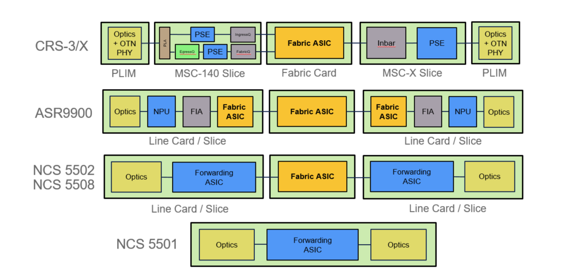

##### FPGA

Digital logic chips/数字逻辑芯片 **集成电路**的一种

Field Programmable Gate Array/现场可编程门阵列  集成电路的一种

**可以对其进行“现场”编程以按照预期的设计工作**。使用FPGA需要特殊的程序，因为它是基于RAM的。要对设备进行编程，您必须首先通过使用计算机来描述“逻辑功能”，方法是绘制示意图或在文本文件中简单地描述该功能。“逻辑功能”的编译通常需要软件。它创建了一个二进制文件以下载到FPGA中，然后该芯片将按照您在“逻辑功能”中的指示进行操作。

##### ASIC

ASIC/**特定应用集成电路**

因特定目的而创建的设备，一旦设计制造完成后电路就固定了，无法再改变。

>比较 FPGA 和 ASIC 就像比较乐高积木和模型。举例来说，如果你发现最近星球大战里面 Yoda 大师很火，想要做一个 Yoda 大师的玩具卖，你要怎么办呢？
>
>有两种办法，一种是用乐高积木搭，还有一种是找工厂开模定制。用乐高积木搭的话，只要设计完玩具外形后去买一套乐高积木即可。而找工厂开模的话在设计完玩具外形外你还需要做很多事情，比如玩具的材质是否会散发气味，玩具在高温下是否会融化等等，所以用乐高积木来做玩具需要的前期工作比起找工厂开模制作来说要少得多，从设计完成到能够上市所需要的时间用乐高也要快很多。

