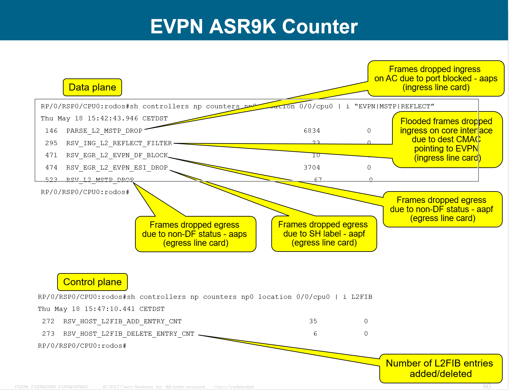

[TOC]

##### Normal command

```bash
#terminal length 0 
#admin show platform
#admin show install active summary
#admin show hw-module fpd location all
#admin show inventory
#admin show diag
#admin show redun
#show process block location all
#show processes memory
#show memory summary location all
#show pfm location all
#show context
#dir /recurse harddisk:
#admin show environment all

#show log
#show run
#show cli history detail
#show configuration commit list
#show configuration commit changes all


#show ip int br
#show int des
```

##### FAN ISSUE

```bash
#admin show environment all
#admin show environment trace
#admin show environment fans
#show environment leds details
#admin show env alarms
```


##### FPGA

```bash
#admin show diag power-supply eeprom-info
#admin show diag power-supply eeprom-info raw
#admin show diag chassis eeprom-info
#admin show diag chassis eeprom-info raw
```


##### L2VPN

```bash
#Show tech l2vpn  [L2VPN PI] 
#Show tech l2vpn platform [ L2VPN PD ]
#Show tech routing bgp [ BGP ]
#Show tech l2rib  [ L2RIB]	
```

###### TS GUIDE

L2VPN, PW其不来的原因

https://techzone.cisco.com/t5/IOS-XR-PI-L2VPN-Eng-Knowledge/L2VPN-Pseudowire-PW-Down/ta-p/856234

Understanding the "ping mpls pseudowire" practically

https://techzone.cisco.com/t5/XR-Platform-Independent-Topics/Understanding-the-quot-ping-mpls-pseudowire-quot-practically/ta-p/827256

LSP Down事件故障排除

https://techzone.cisco.com/t5/IOS-XR-PI-Forwarding-Infra-Eng/IOS-XR-PI-FIB-Troubleshooting-LSP-Down-Events/ta-p/1027144

###### VPWS

```bash
#show l2vpn xconnect group test detail
#show l2vpn xconnect group test 
#show l2vpn forwarding interface gigabitEthernet 0/1/0/2.2000 hardware ingress detail location 0/1/CPU0
```

###### VPLS

```
#show l2vpn bridge-domain bd-name <bd-name>
#show l2vpn bridge-domain group <group-name> bd-name <bd-name> detail

#show l2vpn forwarding bridge-domain <group-name>:<bd-name> mac-address location 0/0/cPU0
#show l2vpn forwarding bridge-domain <group-name>:<bd-name> mac-address detail location 0/0/cPU0
可以使用接口或者mac地址进行过滤   <<< 这个命令其实看的是软件表项，MAC地址是先到硬件表项，再到软件表项同步的，但同步的频率不会太频繁，使用以下的命令及时同步
#show l2vpn forwarding bridge-domain <group-name>:<bd-name> mac-address hardware ingress location 0/0/cPU0
#l2vpn resynchronize forwarding mac-address-table location 0/1/CPU0     <<< 重新同步MAC地址表


```

###### BGP 自动发现 VPLS

```bash
#show bgp l2vpn vpls summary
#show l2vpn discovery 
```

>参考case: **685753454** **了解详细的****BGP** **自动发现** **VPLS**


###### EVPN

```bash
#show l2vpn forwarding bridge-domain <group-name>:<bd-name> mac-address location 0/0/cPU0
#show evpn evi vpn-id <EVI> mac
#show bgp l2vpn evpn rd ROUTER-ID:EVI / route-type 2
#show bgp l2vpn evpn rd  114.112.76.116:10095 [2][0][48][d46d.501f.a23a][0]/104 detail
#show cef external hardware egress detail location 0/0/cPU0
#show mpls forwarding 
#show evpn evi vpn-id 10095 inclusive-multicast detail
#show l2vpn forwarding bridge-domain 1:PBB-edge-10095 evpn inclusive-multicast detail location 0/0/CPU0

#show l2vpn bridge-domain brief
#show l2vpn bridge-domain bd-name 10095 detail    << check status and traffic 

Unicast MAC FIB
#show l2vpn forwarding bridge-domain 1:PBB-edge-10095 mac-address internal 0056.2b72.8323 hardware ingress detail location 0/0/cPU0 
#show l2vpn forwarding bridge 1:PBB-edge-10074 evpn inclusive-multicast hardware ingress detail location 0/0/CPU0

#show l2vpn forwarding bridge-domain 1:PBB-edge-10095 hardware egress detail location 0/0/cPU0

#show controller np counter np all loca 0/0/CPU0 

#sh l2vpn forwarding pbb backbone-source-mac location 0/0/CPU0
```




##### BGP

```bash
#show bgp all all sumary
#show bgp neighbor x.x.x.x detail 
#show tcp brief | in x.x.x.x
#show tcp dump-file list all location 0/rSP0/CPU0 | in x.x.x.x
#show tcp dump-file list all location 0/rSP1/CPU0 | in x.x.x.x
#show tcp dump-file 2001_cb0_1104_2_a__2.20232.179.cl.1552087098 location 0/rSPx/CPU0   <<< 上面两个命令输出的结果
#ping x.x.x.x source x.x.x.x size 1300 counter 100
#show tcp trace location all
#show bgp trace  location all
#show socket trace process bgp

#show tech tcp nsr
#show tech routing bgp 

#debug bgp all 134.159.158.151 out
#debug bgp all 134.159.158.151 in
#clear bgp 134.159.158.151
```

###### TS Guide

[IOS-XR BGP Troubleshooting steps](https://techzone.cisco.com/t5/ASR-9000/IOS-XR-BGP-Troubleshooting-steps/ta-p/805366)

[IOS-XR BGP Troubleshooting steps](https://techzone.cisco.com/t5/ASR-9000/IOS-XR-BGP-Troubleshooting-steps/ta-p/805366#anc2)

###### BGP update 报文出错

```bash
#show bgp update in error neighbor 
#show bgp update in error neighbor 193.218.0.100 detail
```

> Decode BGP 16hex packet 
> http://wwwin-routing.cisco.com/cgi-bin/bgp_decode/bgp_decode.pl

###### BGP version 42947295

> Hit know software issue : CSCun63547  IOS-XR BGP to handle version wrap gracefully.
> https://quickview.cloudapps.cisco.com/quickview/bug/CSCun63547 

###### TCP DUMP 解释

>https://wiki.cisco.com/display/SPRSG/TCP-NSR+TRIAGE
>解释TCP Dumper文件的意思

R = Received from Peer, 
S = Sent out of TCP. 
    In case of NSR is not active for session, S indicates that packet is going out of active TCP to peer[Active TCP dump],
    If case of NSR enabled and active for session, S indicates that packet is going out of standby TCP to peer[Standby TCP dump]
D = Dropped (Usually after successful processing), Line number in D packet should be checked if you think actual drop
s = NSR send instructions from A-RP to S-RP,[Segmentation instruction]
r = NSR send-segment instruction received at S-RP[Standby RP] from A-RP[Active RP]
h = received segment “held” for NSR init-sync,
f = FSSN determined for NSR init-sync
i = internal ACK from S-RP to A-RP for NSR init-sync
a = inject a dummy ack in to the TCP stream, with ACK containing the active's SNDUNA

S - SYN
A - ACK
F - FIN
P - PUSH
U - URGENT
R - RESET

##### *IPSLA

```bash
#Show tech ipsla
#show ipsla responder statistics all ports
#show ipsla  trace responder all
#show ipsla  trace responder all location 0/x/cpu0   <<<< the location which receives the IPSLA traffic
#show track
#show ipsla statistics  <<<<<
#show track brief
#show ipsla statistics
#show ipsla statistics aggregated
#show ipsla statistics aggregated detail
#show ipsla statistics enhanced aggregated
#show ipsla application
#show ipsla history
#show ipsla history full
#show ipsla responder statistics all ports
#show ipsla responder statistics all ports detail
#show ipsla trace master-agent all reverse location all
#show ipsla trace sub-agent all reverse location all
#show ipsla trace twamp all location all
#show ipsla trace responder all reverse location all
#show track
#show track brief
#show ipsla statistics
```

##### Telnet/console 

```bash
#show tcp trace
#show line trace vty 0 error
#show line trace vty 0 slow
#show line trace console slow
#show tty trace info all all
#show tty trace error all all
#show tty trace warning all all
#show processes blocked location all
#show process devc-vty detail
#show process devc-conaux detail
```

###### TS guide

https://techzone.cisco.com/t5/XR-Platform-Independent-Topics/lost-of-managment-access-to-XR-device-telnet-ssh-console/ta-p/350822

##### Segment Routing

```bash
#show isis adjacency tenGigE 0/0/0/0 detail
#show mpls traffic-eng tunnels 5 detail 
#show mpls traffic-eng trace segment-routing
#show isis neighbors
#show interface tunnel-te 4
#show mpls  traffic-eng trace topology
```

##### BNG

```bash
#clear subscriber database connection statistics messages
#show pfilter-ea ha info location 0/0/cpu0 <<<如果BNG dynamic 下有ACL可以使用这个命令查看programming速率
#show subscriber database connection server time-stats 

```

##### BFD

```bash
#show bfd client
#show bfd session
#show bfd session detail
#show bfd session detail location 0/x/CPU0
#show bfd session status history event interface gigabitEthernet x/x/x/x destination x.x.x.x location 0/x/cpu0
#show bfd session status history interface gigabitEthernet x/x/x/x location 0/X/CPU0
#show bfd counters all packet private detail location 0/X/CPU0
#show bfd trace
#show tech routing bfd
```

###### TS GUIDE

https://community.cisco.com/t5/service-providers-documents/bfd-support-on-cisco-asr9000/ta-p/3153191#BFD_Over_Bundle_Member_Interfaces

##### ACL match packet Counter /  Qos match / Packet drop

```bash
pv4 access-list pingtest
10 permit icmp host 1.1.1.1 host 2.2.2.2
15 permit icmp host 2.2.2.2 host 1.1.1.1
20 permit ipv4 any any

在对应的接口下应用这个ACL, 为了监测硬件计数,进接口配置，两个方向都匹配一下，比如
interface TenGigE0/5/0/0
ipv4 address 12.1.1.1 255.255.255.252
ipv4 access-group pingtest ingress hardware-count
ipv4 access-group pingtest egress hardware-count

通过以下命令观察这个ACL在这个接口上所捕捉到的包数量，分别在进出口查看，
#show access-lists pingtest hardware egress interface te 0/5/0/0 location 0/5/CPU0 <<<<<<<查看出方向匹配到的包
#show access-lists pingtest hardware ingress interface te 0/5/0/0 location 0/5/CPU0 <<<<<<<查看进方向匹配到的包


#show lpts pifib hardware static-police location <接口所在板卡>
#show lpts pifib hardware entry statistics location <接口所在板卡>
#show lpts pifib hardware police location <接口所在板卡>
#show controllers fabric fia stats location <接口所在板卡>
#show controllers fabric fia drops ingress location <接口所在板卡>
#show controllers fabric fia drops egress location <接口所在板卡>
#show ipv4 traffic brief location <接口所在板卡>
#show netio drops location <接口所在板卡>
#show spp sid stats location <接口所在板卡>
#show spp node-counter location <接口所在板卡>
#show drop location <接口所在板卡>
#show cef drops location <接口所在板卡>
#show cef drops location <主引擎>
```

