[TOC]

#### Docker 入门教程

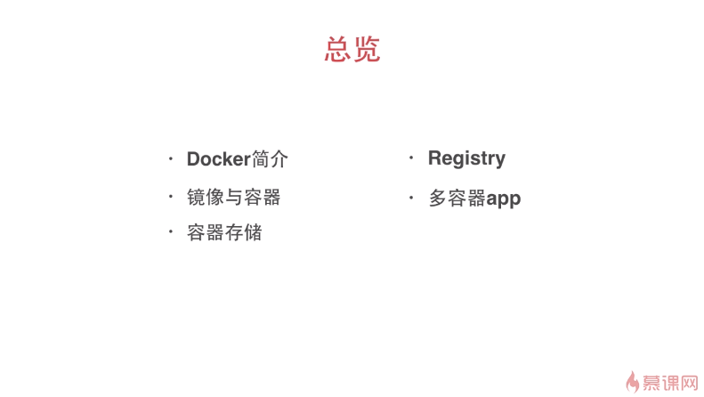

#### Docker介绍

可以粗糙的理解为轻量级的虚拟机。


#### Docker Linux 安装

```bash
[root@xuxing ~]# wget -qO- https://get.docker.com | sh
[root@xuxing ~]# docker info
```

#### Docker架构

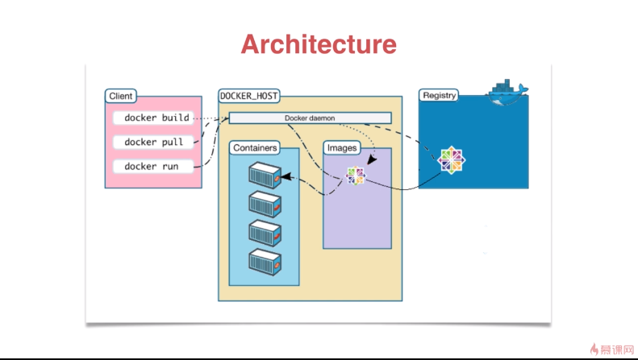

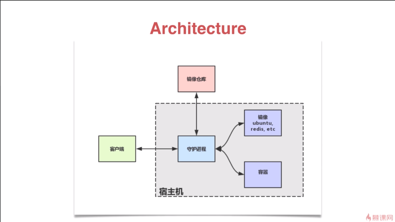

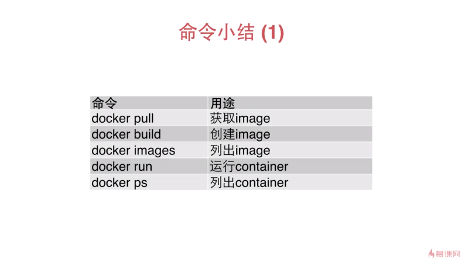

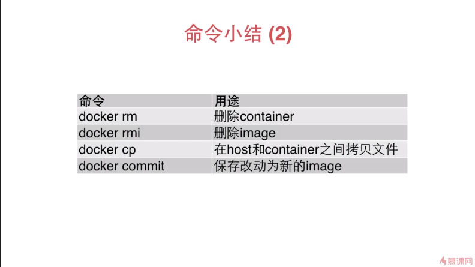

#### Dockerfile

通过编写简单的文件自创docker镜像

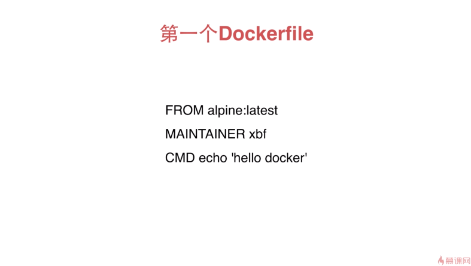


```bash
[root@xuxing docker]# docker build -t hello.docker .
[root@xuxing docker]# docker images
REPOSITORY          TAG                 IMAGE ID            CREATED             SIZE
hello.docker        latest              574bf4f598a7        4 seconds ago       5.61 MB
docker.io/alpine    latest              f70734b6a266        3 weeks ago         5.61 MB
[root@xuxing docker]# docker run hello.docker
```

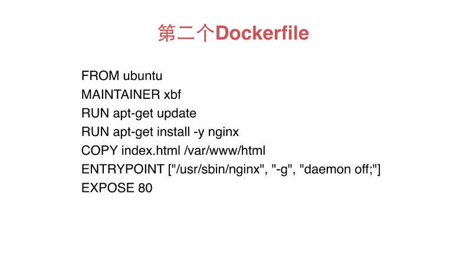


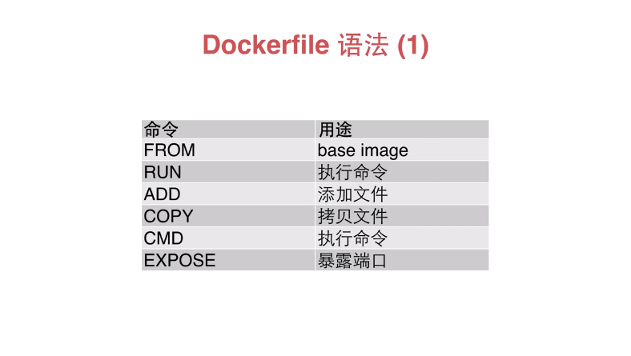

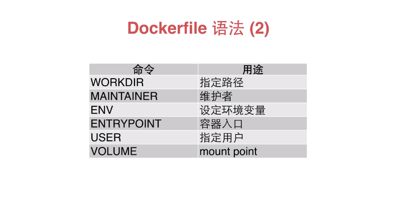

```dockerfile
FROM   用途  base image（指定基础镜像名，从哪里开始）
RUN 执行命令（在容器内执行命令）
ADD 添加文件（往容器里面添加文件，还可以将远程的文件添加到容器里面去）
COPY 拷贝文件 （往容器里面添加文件）
CMD 执行命令（给容器指定执行的入口，通常和engine point来做这个事情）
EXPOSE 暴露端口
WORKDIR 指定路径（指定我们运行命令的路径）
MAINTAINER 维护者
ENV 设定环境变量（为容器里面设置环境变量）
ENTRYPOINT 指定容器入口（在没有指定engine point的时候用cmd启动，如果指定了engine point,cmd所指定的字串就变成entry point后面的一些 arguments(参数)）
USER 指定用户（指定执行该命令的用户，通常不会用root在容器里面执行）
VOLUME  用途mount point （指定容器挂在的卷）
```

#### 镜像分层

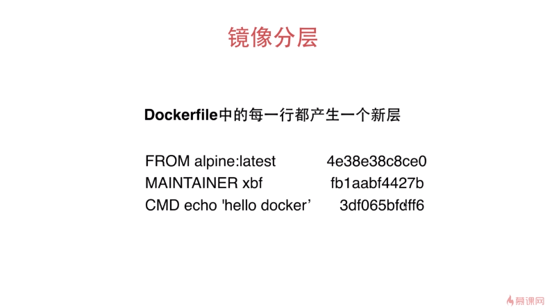


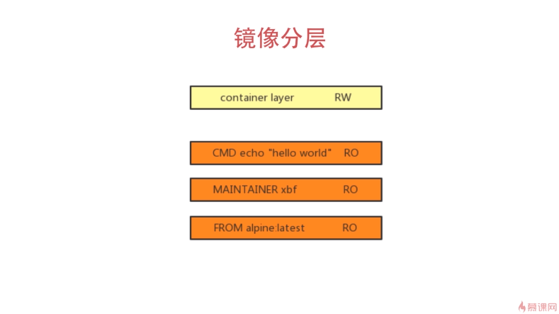

```
Dockerfile中的每一行都产生一个新层

镜像分层的原理及其好处：
分层的好处：假如有很多 container 或者 很多的 Image的话，这些层可以共享。那么存储压力会小很多。运行起来方便。
每个一个命令都是一层，只有容器层是RW，镜像中的各层都是RO
```

#### Volume

提供独立于容器之外的持久化存储。

https://www.imooc.com/video/15730

