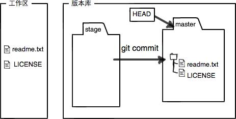

# Git

### 创建版本库

// 安装git后需要配username email

```jsx
$ git config --global user.name "Your Name"
$ git config --global user.email "email@example.com"
$ ssh-keygen -t rsa -C "youremail@example.com"
```

//创建版本库

```jsx
$ git init
```

//把文件添加到版本库 / 提交修改

```jsx
$ git add index.html
$ git commit -m "add file index.html"

//其他命令
$ git diff index.html
$ git status
```

### 版本回退



```jsx
$ git log
$ git log --pretty=oneline

####   HEAD^ 上一个版本 HEAD^^  上上一个版本
$ git reset --hard HEAD^     
$ git reflog

####   丢弃工作区的修改
git restore <file>.

#### 撤销缓存区的修改， 放到工作区
git reset HEAD <file>

### 删除文件
git rm <file>
git commit -m "COMMENT"

```

## 远程仓库

1. 如果你的主机新安装的git， 可能没生成ssh 密钥， 使用以下命令生成:

    ```jsx
    ssh-keygen -t rsa -C "youremail@example.com"
    ```

2. 将.ssh/目录下 的id_rsa.pub copy 出来， 粘贴到GitHub上。（setting→ SSH and GPG keys）

    

3. 验证上述配置生效是否

    ```jsx
    xuxing@XUXING-WT1 MINGW64 /c/git/web (master)
    $ ssh git@github.com
    PTY allocation request failed on channel 0
    Hi xuxing3! You've successfully authenticated, but GitHub does not provide shell access.
    Connection to github.com closed.
    ```

4. Github 新建仓库， 在本地仓库执行以下命令：

```jsx
git remote add origin https://github.com/xuxing3/web.git
git push -u origin master

#### 删除远程库
git remote -v
git remote rm origin
```