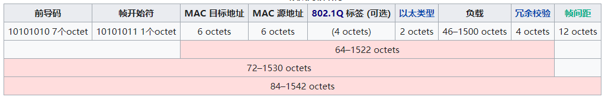
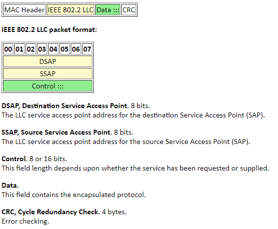
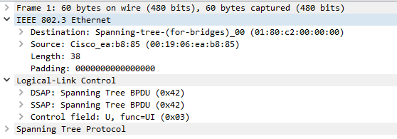
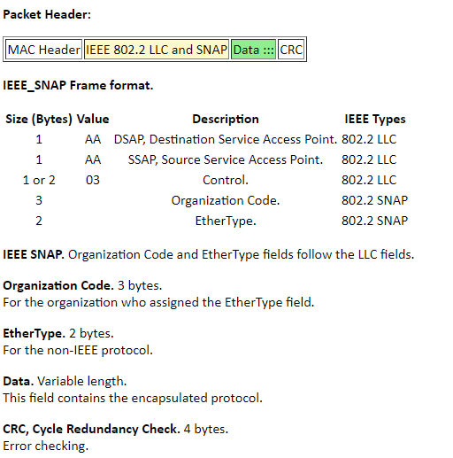
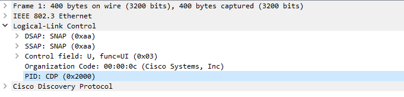

##### 以太网帧类型

- 以太网第二版[[note 3\]](https://zh.wikipedia.org/wiki/以太网帧格式#cite_note-3) 或者称之为Ethernet II 帧，DIX帧，是最常见的帧类型。并通常直接被IP协议使用。
- [IEEE 802.2](https://zh.wikipedia.org/wiki/IEEE_802.2) [逻辑链路控制](https://zh.wikipedia.org/wiki/逻辑链路控制) (LLC) 帧
- [子网接入协议](https://zh.wikipedia.org/w/index.php?title=子网接入协议&action=edit&redlink=1)(SNAP)帧

所有以太帧类型都可包含一个IEEE 802.1Q选项来确定它属于哪个VLAN以及他的IEEE 802.1p优先级(QoS)。IEEE 802.1Q标签，如果出现，需要放在源地址字段和以太类型或长度字段的中间。

##### Ethernet V2

##### IEEE 802.3/802.2 LLC

STP为802.3 SAP帧

##### IEEE 802.3/802.2 SNAP

PVST+和CDP等均为802.3SNAP帧

